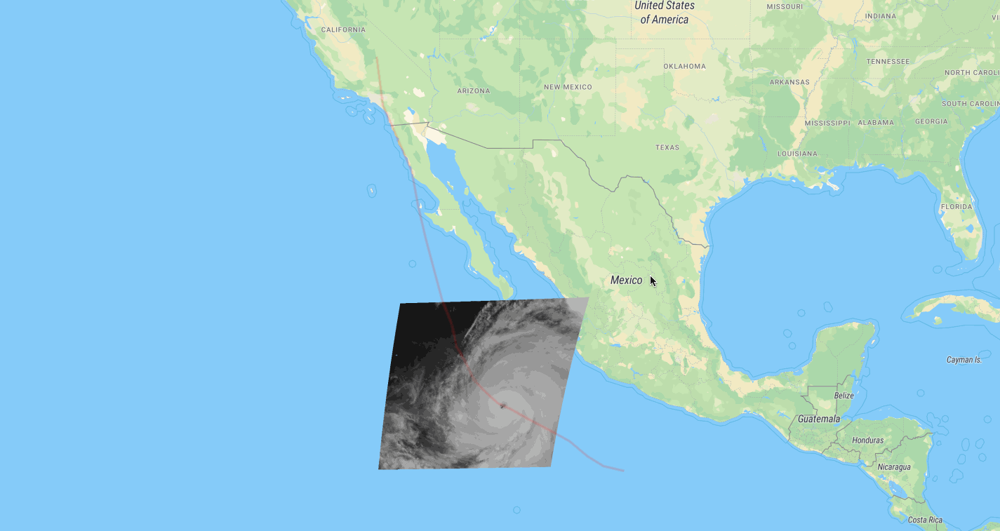

# goes-meso-visualizer



Visualize GOES mesoscale data in a browser map.
A live demo is available at <http://e84-gadomski-hilary-demo.s3-website-us-west-2.amazonaws.com/>.

## Running

```shell
pip install git+https://github.com/Element84/goes-meso-visualizer
```

This installs the `goes-meso-visualizer` command-line executable (CLI), which contains all the commands to build visualizations.
Run `goes-meso-visualizer --help` to see what's available.
We provide an example Makefile to build visualization from the 2023 hurricane that struck the southwestern United States, Hilary:

```shell
make example  # this will take a few minutes
make serve-example
```

## Developing

```shell
git clone git@github.com:Element84/goes-meso-visualizer.git
cd goes-meso-visualizer
pip install -e '.[dev]'
pre-commit install
```

If you need a new requirement, add it to `requirements.in` (or `requirements-dev.in` for dev requirements), then:

```shell
scripts/update-requirements
```
